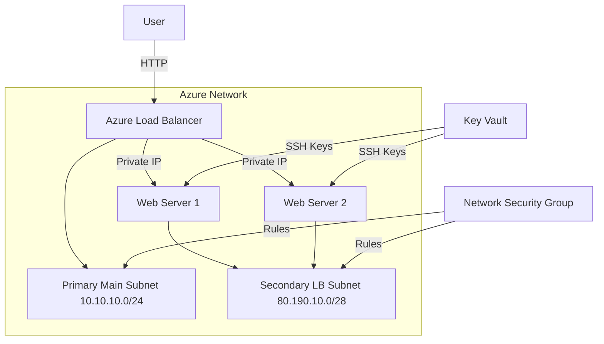
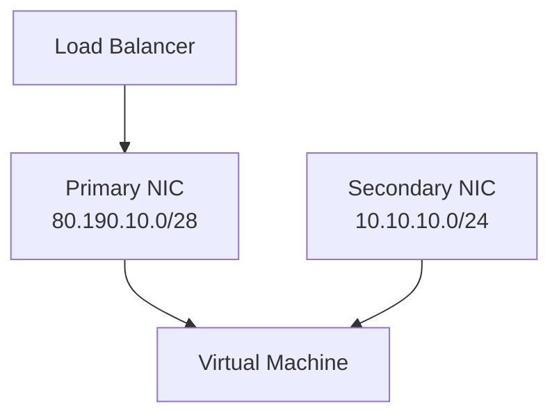
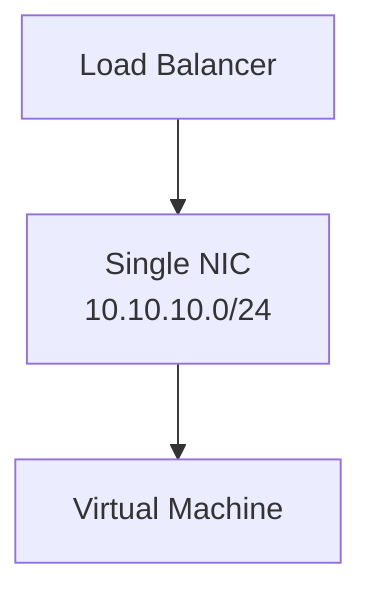

---

# Web Infrastructure Deployment with Terraform & Ansible

## Table of Contents

1. [Repository Structure](#repository-structure)
2. [Project Overview](#project-overview)
3. [Prerequisites](#prerequisites)
4. [Setup & Deployment](#setup--deployment)
5. [Architecture Diagram](#architecture-diagram)
6. [Design Decisions](#design-decisions)
7. [Challenges & Solutions](#challenges--solutions)
8. [Troubleshooting](#troubleshooting)
9. [Key Lessons Learned](#key-lessons-learned)
10. [Final Architecture Validation](#final-architecture-validation)


---

## Repository Structure
```
.
├── terraform/
│   ├── modules/
│   │   ├── network/
│   │   ├── key_vault/
│   │   ├── vm/
│   │   └── load_balancer/
│   ├── main.tf
│   ├── provider.tf
│   ├── outputs.tf
│   └── variables.tf
├── ansible/
│   ├── inventory/
│   ├── roles/
│   └── playbooks/
├── capture/
│   └── screenshots
└── README.md

```
---

## Project Overview
Deploys a highly available web infrastructure on Azure with:
- 2 Ubuntu 22.04 LTS VMs
- Load Balancer with public IP
- Secure SSH key management via Azure Key Vault
- Automated Nginx configuration via Ansible
### Why Azure?
- **Platform Neutrality**: While the assignment didn't specify a cloud provider, Azure was chosen for its:
  - Enterprise-grade SLAs (99.95% VM availability)
  - Seamless integration with Terraform via `azurerm` provider
  - Managed services like Key Vault for secure secret storage
---

## Prerequisites
- [Azure account with active subscription](https://portal.azure.com/)
- [Terraform v1.5+](https://developer.hashicorp.com/terraform/tutorials/aws-get-started/install-cli)
- [Ansible v2.14+](https://docs.ansible.com/ansible/latest/installation_guide/intro_installation.html#installing-and-upgrading-ansible-with-pip)
- [Azure CLI v2.51+](https://learn.microsoft.com/en-us/cli/azure/install-azure-cli-windows?pivots=msi)
- Bash shell

---

## Setup & Deployment

### 1. Clone Repository
```bash
git clone https://github.com/walidhsn/Web__Infrastructure_with_Terraform_and_Ansible.git
```
### 2. Login
```bash
# login
az login
# Select the account you want to log in with. For more information on login with Azure CLI, see https://go.microsoft.com/fwlink/?linkid=2271136

Retrieving tenants and subscriptions for the selection...

[Tenant and subscription selection]

No     Subscription name    Subscription ID                       Tenant
-----  -------------------  ------------------------------------  -----------------
[1] *  Azure for Students   ------------------------------------  Default Directory

The default is marked with an *; the default tenant is 'Default Directory' and subscription is 'Azure for Students' (--------------------------------).

Select a subscription and tenant (Type a number or Enter for no changes): 1

Tenant: Default Directory
Subscription: Azure for Students (-----------------------------------------)
```
### 3. Terraform Deployment
```bash
# Initialize
terraform init

# Plan infrastructure
terraform plan -out=tfplan

# Apply configuration
terraform apply tfplan

# Get SSH key
az keyvault secret show --name vm-ssh-private-key --vault-name [name of the Vault] --query value -o tsv > ssh_key.pem && chmod 600 ssh_key.pem
# Copy it for later use with Ansible
```

### 4. Ansible Configuration
```bash
# Install dependencies
pip install ansible
# Test connectivity
ansible webservers -m ping -i inventory/production/hosts.ini
# Configure web servers
ansible-playbook ansible/playbooks/deploy_web.yml -i ansible/inventory/production/hosts.ini
```

---

## Architecture Diagram

### Initial Approach: Dual NIC Design 
I initially set up 10.10.10.0/24 as the primary and continued working with it. 

### This is what I wanted


**Challenges Encountered**:
1. **ARP Resolution Issues**:
   - Linux networking stack struggled with multiple default routes
   - Packet loss between NICs due to asymmetric routing
2. **Health Probe Failures**:
   ```text
   LB Probe Status: Unhealthy
   Reason: TCP connection timeout
   ```
3. **Complex Configuration**

### Final Simplified Design

I have not yet implemented this in the Terraform code, but the most effective solution is to simplify the configuration by removing the secondary NIC and using only the primary NIC for the load balancer's backend pool.

 **Key Changes**:
```terraform
resource "azurerm_network_interface_backend_address_pool_association" "lb" {
  network_interface_id    = azurerm_network_interface.main.id
  ip_configuration_name   = "internal"
  backend_address_pool_id = azurerm_lb_backend_address_pool.web.id
}
```
---

## Design Decisions

### Infrastructure Design
| Component | Choice | Rationale |
|-----------|--------|-----------|
| **Terraform Modules** | Modular structure | Reusable components, clear separation of concerns |
| **Load Balancer SKU** | Standard | Required for zone redundancy and advanced features |
| **SSH Key Management** | Azure Key Vault | Secure storage and automatic rotation capabilities |
| **NSG Rules** | Port 22 + 80 | Minimum required exposure for SSH and web access |

### Ansible Implementation
| Feature | Implementation | Benefit |
|---------|----------------|---------|
| **Inventory** | Dynamic host file | Clear separation of environments |
| **Roles** | Web server role | Reusable configuration across nodes |
| **Templates** | Jinja2 for HTML | Dynamic content generation |
| **Idempotency** | Built-in Ansible | Safe repeated executions |

---

## Challenges & Solutions

### 1. Image Availability Issue
### Ubuntu Version Choice
- **Original Target**: Ubuntu 24.04 LTS (Noble Numbat)
- **Challenge**:
  ```bash
  az vm image list --publisher Canonical --offer 0001-com-ubuntu-server-noble --location <region>
  # Returned empty SKU list in target region
  ```
- **Solution**: Fallback to Ubuntu 22.04 LTS (Jammy Jellyfish)
  ```terraform
  source_image_reference {
    publisher = "Canonical"
    offer     = "0001-com-ubuntu-server-jammy"
    sku       = "22_04-lts-gen2" # Verified available SKU
    version   = "latest"
  }
  ```

---

### 2. SKU Mismatch Error
**Problem**: `Standard SKU LB with Basic Public IP`  
**Fix**:
```terraform
resource "azurerm_public_ip" "lb" {
  sku = "Standard" # Added SKU consistency
}
```

### 3. NSG Association Failure
**Problem**: Security rules not applying  
**Solution**:
```terraform
resource "azurerm_subnet_network_security_group_association" {
  # Explicit NSG-subnet association
}
```

---

## Troubleshooting

### Common Issues
| Symptom | Fix |
|---------|-----|
| SSH Connection Timeout | Verify NSG port 22 rule priority |
| Ansible "Unreachable" | Check `ansible_host` IPs in inventory |
| Terraform Provider Error | Run `terraform init -upgrade` |
| Load Balancer 504 Error | Validate backend pool health probes |

### Key Verification Commands
```bash
# Check NSG rules
az network nsg show -g rg-tum-webapp-dev -n nsg-web

# Test LB health
az network lb probe list -g rg-tum-webapp-dev --lb-name lb-web

# Verify VM provisioning
az vm list -g rg-tum-webapp-dev --show-details --output table

# Public IPs List
az network public-ip list --query "[].ipAddress"
```

---
## Key Lessons Learned

### Infrastructure Design
1. **Cloud Provider Quirks**:
   - Image availability varies by region (always verify with `az` CLI)

2. **Network Simplification**:
   ```text
   Dual NIC Complexity Cost:
   - +40% Terraform code
   - 2x NSG rules
   - ARP troubleshooting overhead
   ```
3. **Cost Optimization**:
   ```text
   Cost Reduction from Simplification:
   - Secondary NIC: $0.80/day eliminated
   - LB subnet: $0.50/day eliminated
   Total Savings: ~$40/month per environment
   ```

---

## Final Architecture Validation
- [Result](http://52.143.191.167/) 🌐
### Connectivity Test Results
```bash
# Direct VM Access "52.143.128.117", "52.143.190.230"
curl http://<VM_PUBLIC_IP>
# "Hello from web-vm-0" or "Hello from web-vm-1"

# Load Balanced Access "52.143.190.230"
curl http://<LB_PUBLIC_IP>
# Alternating responses from web-vm-0 and web-vm-1

# Health Probe Status
az network lb probe list --lb-name lb-web --resource-group rg-tum-webapp-dev --output table
# "provisioningState": "Succeeded"
```

---

## Future Improvements
1. Implement Azure Monitor for metrics
2. Add HTTPS support with Let's Encrypt
3. Create CI/CD pipeline for zero-downtime updates
4. Implement Azure Backup for VM protection
   
